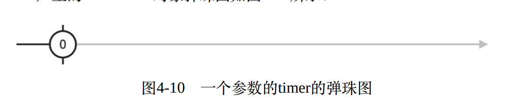
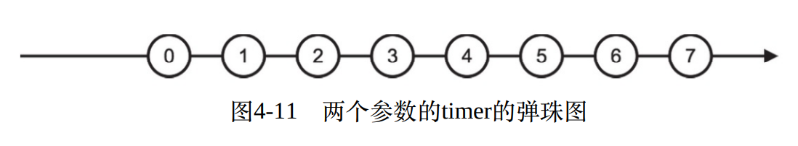

# 创建数据流

除了上帝,一切皆有起源.
作为数据流的源头, 也就是能够创建Observable的操作符.
这一类操作符大多都是静态方法(并不全是).

创建类操作符一览:
|需求|对应的操作符|
|:---:|:---:|
|直接操作观察者|create|
|根据有限的数据产生同步的数据流|of|
|产生一个数值范围之内的数据|range|
|以循环的方式产生数据|generate|
|重复产生数据流中的数据|repeat 和 repeatWhen|
|产生空数据流|empty|
|产生直接出错的数据流|throw|
|产生永不完结的数据流|never|
|间隔时间产生持续数据流|interval 和 timer|
|从数组等枚举类型数据产生数据|from|
|从Promise对象产生数据流|fromPromise|
|从外部事件对象产生数据流|fromEvent 和 fromEventPattern|
|从AJAX请求结果中产生数据流|ajax|
|延迟产生数据流|defer|

## 同步的数据流
对于同步的数据流只需要关心数据是什么，以及数据的先后顺序即可。

### create
create这个操作符其实就是Observable构造函数的一个封装,没有什么特殊之处。
create操作符的实现:
```js
Observable.create = function( subscribe ){
    return new Observable(subscribe);
}

```
使用create我们可以直接控制Observable的行为；但是作为应用开发者，平时大多数时候我们都不会使用这个操作符， 因为Rxjs已经提供了大量的创建类操作符，这些操作符几乎涵盖了大部分的使用场景。所以我们没有必要再重新去造轮子。


### of 列举数据
利用of操作符，可以轻松创建一个指定数据集合的Observable。比如我们需要产生3个整数的集合，利用create操作符可能需要些很多代码，但是利用of仅需1行代码。
```js
//使用create
//使用create操作符创建3个正整数集合。
    Rx.Observable.create(observer => {
        observer.next(1);
        observer.next(2);
        observer.next(3);
        observer.complete();
    }).subscribe(
        console.log,
        null,
        ()=>{console.log('complete')}
    )
```
使用of操作符创建
```js
Rx.Observable.of(1,2,3).subscribe(console.log, null, ()=>{console.log('complete')});
```
**of产生的数据流都是同步的，也就是说产生的数据都会挤在同一时间点上**


of操作符是ColdObservable,也就是说每次订阅这个Observable时，都会从头获得数据。

### range：指定范围
如果要用of产生从1到100的数据流, 虽然是可以实现，不过这样的写法确实不可取。range可以产生一个连续数字(不一定是整数)的范围。
`range(start, count)`函数接受2个参数， start代表范围的起点值， count代表吐出的数据个数, 每当吐出一个数据之后，range便会将值递增1.
```js
//生成一个从1到100的连续的数据流。
Rx.Observable.range(1, 100).subscribe(console.log, null, ()=>console.log('complete'))
```
```js
//生一个从10.5到15.5的连续的数据流。
Rx.Observable.range(10.5, 5).subscribe(console.log, null, ()=>console.log('complete'))
```
和of操作符一样， range操作符产生的数据也是会堆积在同一时刻。
  

### generate：Rxjs中的for循环
generate操作符类似一个for循环： 产生一个初始值，每次递增这个初始值，直到满足某个条件时才会停止循环。
```js
//产生10以内为偶数的平方。
Rx.Observable.generate(
    0, //初始值
    value => value <= 10,  //如果条件满足 值 <= 10那么继续执行。
    value => value + 2,   //每次执行之后值递增2
    value => value * value // 输出结果： 偶数的平方
).subscribe(console.log)
```
`generate`函数一共有4个参数， 第一个参数是初始值， 第二个参数是条件判断， 第三个是值的递增， 第四个参数是产生的结果。
```js
//利用generate实现range的功能
const range = (start ,count) => {
    const max = start + count;
    return Rx.Observable.generate(
        start,
        v => v < max,
        v => v + 1,
        v => v
    )
}
```

### repeat：重复某个Observable的数据流
上面接触的操作符都是静态操作符。而repeat操作符为实例操作符，你可以使用打补丁的方式引入， 或者使用支持lettable的方式引入。
打补丁方式引入
```js
import 'rxjs/add/operaotr/repeat'
```
lettable支持的方式引入
```js
import { repeat } from 'rxjs/operators/repeat'
```
repeat的功能就是重复上游的Observable若干次。
若需要一个 1，2，3的序列10次。
```js
//重复1，2，3 序列10次
Rx.Observable.of(1,2,3).repeat(10).subscribe(console.log);
```
关于repeat的实现： repeat会重复订阅并退订上游的Observable 10次。
```js
//每隔1秒生成一个数字， 直到第4秒上游Observable完结。
Rx.Observable.create(observer=>{
    console.log('Observable 被 observer subscribe了！')
    setTimeout(() => observer.next(1), 1000)
    setTimeout(() => observer.next(2), 2000)
    setTimeout(() => observer.next(3), 3000)
    setTimeout(() => observer.complete(), 4000);
    return {
        unsubscribe : ()=>{ console.log('退订了Observable') }
    }
}).repeat(2).subscribe(console.log, null , ()=> console.log('repeat complete'));
```
输出结果：
> Observable 被 observer subscribe了！
> 1
> 2
> 3
> 退订了Observable
> Observable 被 observer subscribe了！
> 1
> 2
> 3
> repeat complete
> 退订了Observable

repeat会在上游的Observable完结之后(因为需要确定上游的Observable不会吐出更多数据)，取消订阅(unSubscribe)，然后立刻重新订阅(subscribe).重复的次数取决于传入repat的参数值。

  


repeat是十分依赖上游Observable的完结的。如果上游Observable始终不会完结，那么repeat也不会执行重复订阅的操作。
```js
//如果上游的Observable不及时完结。
Rx.Observable.create( observer => {
    console.log('Observable 被 observer subscribe了！')
    setTimeout(() => observer.next(1), 1000)
    setTimeout(() => observer.next(2), 2000)
    setTimeout(() => observer.next(3), 3000) 
    return {
        unsubscribe : ()=>{ console.log('退订了Observable') }
    }
}).repeat(2).subscribe(console.log, null , ()=> console.log('repeat complete'));
```
输出结果：
> Observable 被 observer subscribe了！
> 1
> 2
> 3

**repeat会等待上游Observable完结， 如果上游不完结，那么repeat是没有意义的**

### empty throw never 操作符
这3个操作符可以直接使用
#### empty
```js
 //empty 产生一个Observable什么都不做，然后立刻完结
Rx.Observable.empty().subscribe(
    console.log, 
    null, 
    ()=> console.log('empty complete')
)
```
输出结果：
> empty complete
  

#### throw
```js
//throw 产生一个Observable什么都不做，然后抛出一个错误
Rx.Observable.throw().subscribe(
    console.log, 
    ()=> console.log('throw error'), 
    ()=> console.log('throw complete')
)
```
输出结果：
> throw error
  

#### never
```js
//newver 产生一个Observable 什么都不做， 永远也不会完结。
Rx.Observable.never().subscribe(
    console.log, 
    ()=> console.log('never error'), 
    ()=> console.log('never complete')
)
```
输出结果:啥也没有！
  


## 产生异步的数据流

### interval 和 timer 定时持续的产生数据流

interval 和 timer 对应了js中的 `setInterval` 和  `setTimeout`.但是不完全等同于`setInterval`和`setTimeout`.

#### interval
setInterval是每隔一段时间执行传入的函数。而interval则是每隔一段时间就吐出一个**从0递增**的数据。interval 和 timer 第一次吐出的值均为0，然后每次递增1。如果初始值需要从1开始，可以利用map操作符进行映射，rxjs操作符的设计原则是每个操作符都应该保持简洁功能应该单一。

`Observable.interval(time)`方法接受一个类型为number的参数作为时间间隔毫秒数，然后按照这个时间间隔依次输出递增的整数序列。

```js
//每隔1.5s吐出一个递增的序列，永不停止。
Rx.Observable.interval(1500).subscribe(console.log)
```

`interval`不会主动调用下游的complete函数完结。想要停止就必须做退订动作。

#### timer
`timer`对应`setTimeout` `timer`的第一个参数可以是number，也可以是一个Date对象。如果第一个参数是number， 就代表毫秒数， 产生的Observable会在指定毫秒数之后吐出0然后立刻完结。如果是Date对象那么则到达该时间点时吐出0然后完结。

```js
//2s之后吐出0然后完结。
Rx.Observable.timer(2000).subscribe(
    console.log,
    null,
    ()=> console.log('complete')
);
//1s之后吐出0然后完结。
Rx.Observable.timer(new Date(Date.now() + 1000)).subscribe(
    console.log, 
    null, 
    ()=> console.log('complete')
)
```
  

`timer`还拥有第二个参数， 第二个参数是一个number， 如果使用了第二个参数timer就可以持续产生数据，类似于interval。

```js
//2s之后开始每隔1s持续产生从0递增的数据。
Rx.Observable.timer(2000, 1000)..subscribe(
    console.log,
    null,
    ()=> console.log('complete')
);
```
对应的弹珠图
 

可以将timer理解为interval的超集。如果timer的2个参数值一样，那么效果就等同于interval
```js
Rx.Observable.timer(1000,1000)
Rx.Observable.interval(1000)
```

### from 可把一切转化为Observable
from操作符是创建类操作符中包容性最强的一个了。因为只要接受的参数像Observable就行，然后生成一个真的Observable。

像Observable的对象： 数组, 字符串，生成器(generator)， Promise 都很像Observable对象。


```js
//将数组转换为Observable对象
Rx.Observable.from([1,2,3]);
//不仅是支持， 类数组也可以
Rx.Observable.from({
    0: 1,
    1: 2,
    2: 3,
    length : 3
})
```

在ES6中，有一个generator概念。generator表面上是一个函数，不过可以通过yeild字段返回一个阶段性的结果，并将控制权交给函数调用者来决定是否需要继续执行这个函数。generator实际上是实现了一种Iterable类型。

from也可以将generator转换为Observable
```js
 //将generator转换为Observable
function * getNumber(max){
    for(let i = 0; i < max; i++){
        yield i;
    }
}
Rx.Observable.from(getNumber(3)).subscribe(console.log)
```
对于Promise, from和fromPromise完全一样。 

### fromPromise 异步处理的交接
对于Promise, 如果这个Promise成功Resolve了，那么from产生的Observable就会吐出Promise的结果，并且立刻完结。如果这个Promise发生了Reject，那么from产生的Observable也会立刻产生error事件。

```js
//promise再3s后resolve,同时吐出数据：100
Rx.Observable.from(new Promise((resolve, reject)=>{
    setTimeout(()=>{
        resolve(100)
    },3000)
})).subscribe(console.log)
```

```js
//当Promise reject的时候
Rx.Observable.from(Promise.reject('errrr')).subscribe(
    null, 
    (err) => console.log(err)
)
```

### fromEvent Rxjs与DOM的桥梁

fromEvent可以将各种DOM事件(还包括了Nodejs事件)转换为Observable.
```js
//第一个参数为DOM元素, 第二个参数为事件名称.
Rx.Observable.fromEvent(document.querySelector('#add'), 'click')
    .subscribe(
        (e)=>{
            console.log('click', e);
        }
    )
```
fromEvent是一个HotObservable.只有从订阅那一刻开始才会接收到数据.

### ajax 将ajax转换为Observable

```js
//获取rxjs在github上的start
Rx.Observable.ajax("https://api.github.com/repos/ReactiveX/rxjs", {
          responseType: "json",
})
    .map((resp) => resp.response)
    .subscribe((value) => {
        document.querySelector("#start").innerText = value.stargazers_count;
    });
```

### repeatWhen repeat的加强

repeat可以再上游Observable完结之后重新订阅.而无法再完结之后等待一会再重新订阅.repeatWhen则可以.
```js
 //repeatWhen 当上游完结之后, 可以控制什么时候再去重新订阅上游,而不像repeat是立刻重新订阅上游
//repeatWhen接受一个函数, 这个函数需要返回一个Observable, 这个Observable用于控制什么时候重新订阅上游.当这个Observable吐出第一个数据时,就会重新订阅上游.
//每1秒repeat一次
const notifier = ()=> Rx.Observable.interval(1000);
Rx.Observable.from([1,2,3]).repeatWhen(notifier);
```

对于异步的数据进行repeatWhen时,需要精确直到上游Observable什么时候完结, 所以使用interval就不行了.
```js
//上游完结时,notification$就会吐出一个数据, 然后通过delay操作符(延迟)控制repeat的节奏.
const notifier = (notification$)=> notification$.delay(2000)
```

notifier的参数实际上⼀种特殊的Observable对象，它既是Observable也
是Observer，在RxJS中被称为Subject


### defer 延迟创建Observable

数据源头的Observable需要占⽤资源，像fromEvent和ajax这样的操作符，还需要外部资源，所以在RxJS中，有时候创建⼀个Observable的代价
不⼩，所以，我们肯定希望能够尽量延迟对应Observable的创建，但是从⽅便代码的⾓度，我们又希望有⼀个Observable预先存在，这样能够⽅便订阅。

⼀⽅⾯我们希望Observable不要太早创建，另⼀⽅⾯我们又希望Observable尽早创建，这是⼀个⽭盾的需求，解决这个⽭盾需求的⽅式，就是依然创建⼀个Observable。但这个Observable只是⼀个代理（Proxy），在创建之时并不会做分配资源的⼯作，只有当被订阅的时候，才会去创建真正占⽤资源的Observable，之前产⽣的代理Observable会把所有⼯作都转交给真正占⽤资源的Observable。

defer接受⼀个函数作为参数，当defer产⽣的Observable对象被订阅的时候，defer的函数参数就会被调⽤，预期这个函数会返回另⼀个Observable对象，也就是defer转嫁所有⼯作的对象。因为Promise和Observable的关系，defer也很贴⼼地⽀持返回Promise对象的函数参数，当参数函数返回Promise对象的时候，省去了应⽤层开发者使⽤fromPromise转化⼀次的劳动。

```js
const observableFactory = () => Observable.of(1,2,3);
//当source$被订阅时才会产生真正的数据流
cosnt source$ = Rx.Observable.defer(observableFactory);
```

⽐如，我们希望通过AJAX来获取服务器端的数据，可是并不想在程序启动阶段就把AJAX请求发送出去，就可以利⽤defer产⽣⼀个Observable对象，当这个Observable对象被订阅的时候才发送AJAX请求

```js
const observableFactory = () => Observable.ajax(ajaxUrl);
const source$ = Observable.defer(observableFactory);
```

