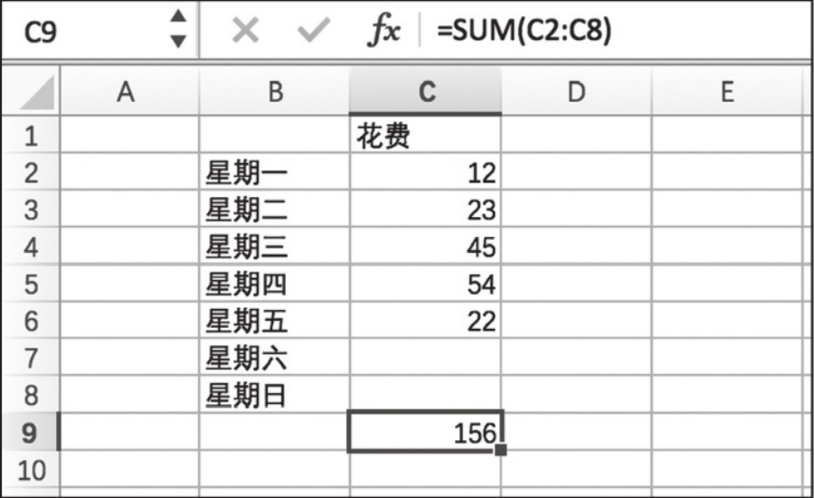

# 铺垫

## 函数式编程

* 声明式(Decalarative)
    声明式编程的对立方是命令式. 声明式编程开发者通常只会关心想做什么,而不会去注重是怎么实现的.而命令式编程通常会关心实现的步骤和算法.
    例如需要实现2个方法:double, addOne.用于将数组的每一项乘以2和数组的每一项都加一.
    
    ```js
    //命令式:
    function double(arr){
        let result = [];
        for(let i = 0; i < arr.length; i++){
            result.push(i * 2);
        }
        return result;
    }

    function addOne(arr){
        let result = [];
        for(let i = 0 ; i < arr.length; i++){
            result.push(i + 1);
        }
        return result;
    }
    ```
    可以看到```double``` 和```addOne```方法中有许多重复的代码, 唯一不一样的地方就是在push的时候对i的操作不一样.
    ```js
    //声明式
    const double = arr => arr.map(i => i * 2);
    const addOne = arr => arr.map(i => i + 1);
    ```
    声明式的实现则简单了很多, 多亏了ES6提供的map函数, 而map函数就是将循环数组, 并将数组的每一项操作之后放入新的数组这一系列模式抽取出来, 就不用重复的编写代码了.

* 纯函数(Pure Function)
    纯函数指没有副作用的函数,即在函数当中没有异步操作,没有ajax请求等不确定性的因素影响.函数的输出结果完全受参数所影响, 而且函数不会修改任何外部遍历,也不会修改传入的参数.就像数组的```map```和```filter```方法,总是会返回一个新的数组,而不会修改传入的数据.

* 数据不可变(Immutability)
    数据不可变性就是当我们修改数据的时候,总是会返回一个新的引用.而不是在原有的数据上进行修改.


## 响应式编程(Reactive)
  
 在Excel中给C9的格式设置了从C2~C8求和的函数之后, 无论在C2~C8中输入什么数据, C9会自动计算C2~C8格子的和.

```js
// Vue3 的响应式
const add = (a, b)=> computed(()=> a + b);
const c = a + b;
//如果 a 和 b 的值发生改变时, c的值会自动变化.
```

## Reactive Extension(Rx)
Rx就是实现响应式编程的一套工具.Rx是⼀套通过可监听流来做异步编程API。

Rx的概念最初由微软公司实现并开源,也就是Rx.NET，因为Rx带来
的编程⽅式⼤⼤改进了异步编程模型，在.NET之后，众多开发者在其他平
台和语⾔上也实现了Rx的类库。


