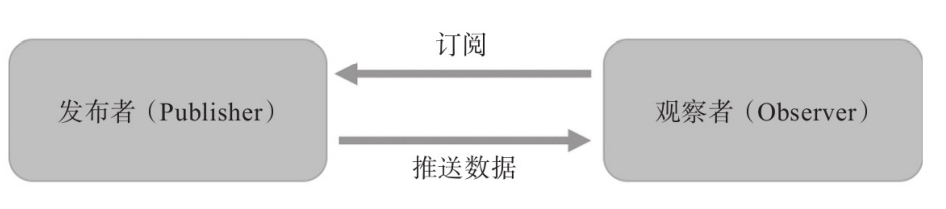
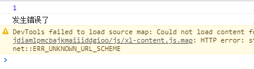
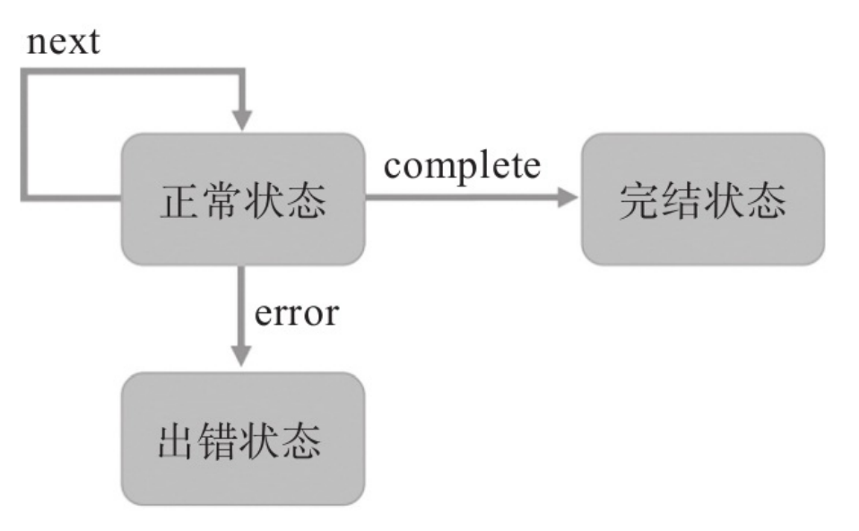
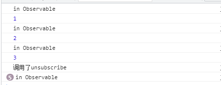

# Observable 和 Observer

Observable 意为可被观察的对象, 而Observer 意为观察者. 而可被观察对象和观察者之间的桥梁则是subscribe, 换句话说通过subscribe来关联观察者所要观察的可被观察对象.

在Rxjs中数据流就是Observable ,Observable实现了2种设计模式:
* 观察者模式(observer pattern)
    1. 观察者模式要解决的问题就是在一个持续产生事件的场景下, 如何分割功能,让不同的模块只处理一部分的逻辑, 这种分而治之的思想就是观察者模式的基本概念.
    2. 观察者模式将逻辑分为了 **发布者(Publisher)**和**观察者(Observer)** 两个部分.
    发布者通常只用关系数据是如何产生的,而不用关系数据要如何处理.当数据产生之后,发布者需要通知订阅了该发布者的观察者们, 将数据交给观察者处理. 
    而观察者不用关心数据的来源, 只需要关心处理数据这一部分的逻辑.
    3. 在Rxjs中, Observable对象就是发布者, 通过Observable对象的subscribe函数将发布者和观察者连接起来.
      

* 迭代器模式(iterator pattern)
  迭代器是指一个可以遍历数据集合的对象.
  通常迭迭代器都会包含以下几个函数:
  * getCurrent : 获取当前游标所指向的对象.
  * moveToNext(next) : 将游标指向下一个对象.
  * isDone : 代表是否已经完成遍历.

## 创造第一个Observable
```js
//产生一个Observable
        const source$ = new Rx.Observable( observer => {
            //这里的observer就代表subscribe时传入的theObserver.
            //但是这里的observer并不完全等于theObserver,而是由rxjs包装后的observer.
            //该函数会决定如何产生数据, 也就是publisher
            //将产生的数据推送给Observer
            observer.next(1);
            observer.next(2);
            observer.next(3);
        });
        //观察者Observer
        const theObserver = {
            next : item => console.log(item)
        }
        //将Observable和Observer连接起来
        //只有subscribe之后observable才会开始推送数据.
        source$.subscribe(theObserver);
```
### 创造跨越时间的Observable
```js
        const source$ = new Rx.Observable(observer =>{
            let i = 0;
            //每隔一秒向Observer推送一个数据
            const timer = setInterval(()=>{
                observer.next(++i);
                //直推送3次
                if(i >= 3){
                    clearInterval(timer);
                }
            },1000);
        });
        const theObserver = {
            next : item => console.log(item)
        };
        source$.subscribe(theObserver);
```
### 创造永无止境的Observable
```js
        const source$ = new Rx.Observable(observer=>{
            let count = 0;
            //从Observable中吐出无穷无尽的数据.
            setInterval(()=>{
                observer.next(++count)
            }, 1000);

        })
        const theObserver = {
            next : item => console.log(item)
        };
        source$.subscribe(theObserver);
```
### Observable的完结
```js
        //observable通过next函数来告诉observer现在推送的数据,而没办法告诉   observer数据的完结(没有更多数据了).
        //complate 函数就是用于告诉observer 没有更多数据了.
        const source$ = new Rx.Observable(observer =>{
            let i = 0;
            
            const timer = setInterval(()=>{
                observer.next(++i);
                //直推送3次
                if(i >= 3){
                    clearInterval(timer);
                    //告诉observer没有数据了
                    observer.complete();
                }
            },1000);
        });
        const theObserver = {
            next : item => console.log(item),
            complete : () => console.log('没有更多数据了')
        };
        source$.subscribe(theObserver);
```
### Observable的错误处理
```js
        //理想情况下Observable产生数据给Observer消耗, 有时候Observable难免会发生错误而无法继续推送数据给observer了.
        //可以通过error告诉observer出错了.
        const source$ = new Rx.Observable(subsribe => {
            subsribe.next(1);
            subsribe.error('error');
            subsribe.complete();
            
        });
        const theObserver = {
            next : item => console.log(item),
            complete : ()=> console.log('没有更多数据了'),
            error : () => console.log('发生错误了')
        }
        source$.subscribe(theObserver);
```
输出结果:
  

当observable发生了错误之后,该observable就会进入完结状态;**一个Observable只有一种完结状态(complete || error)**,所以observer的complete并没有执行;
因为传入Observable的observer是被Rxjs包装之后的对象, 所以就算在error之后强行调用complate也不会执行.
  

### 简单的Observer
```js
    const source$ = new Rx.Observable((observer) => {
        observer.next(1);
        observer.error("error");
        observer.complete();
      });
      //observer提供3个方法next, complete , error 对应了Observable的3种状态.
      //observer可以是一个对象, 为了简化observer,在subscribe的时候也可传入3个函数分别代表next error complete.
      /** 对象形态的observer **/
      const theObserver = {
        next : item => console.log(item),
        complete : ()=> console.log('没有更多数据了'),
        error : () => console.log('发生错误了')
      }
    /** 函数形态的observer **/
      source$.subscribe(
        (item) => console.log(item),//next
        null, // error, 当Observable比较简单时,或者不关心error时, 可以不用传入error
        () => console.log("没有更多数据了") //complete
      );
```

### Observable的退订
```js
        //无穷无尽的Observable
        const source$ = new Rx.Observable( observer =>{
            let count = 0;
            setInterval(()=>{
                console.log('in Observable')
                observer.next(++count);
            },1000);
            return {
                //退订的回调函数,rxjs会在退订之后调用这个函数
                //该函数可以用于进行一些后续处理
                unsubscribe : ()=>{ console.log('调用了unsubscribe') }
            }
        });
        //在subscribe之后会返回一个对象, 这个对象里面提供了一个unsubscribe方法,用于断开Observable和observer之间的连接.
        const subscription = source$.subscribe(console.log);
        setTimeout(()=>{
            subscription.unsubscribe();
        }, 3500)
```
创造一个Observable会吐出无穷无尽的数据. 3.5秒之后,我不想处理这个Observable的数据了, 通过unsubscribe退订.
运行截图:
  
即使是在退订了Observable之后,Observable内部依然会继续吐出数据,只不过这个时候Observer已经不会再响应了.所以**observer只会在subscribe之后收到数据,在unsubscribe之后就不会再收到数据了**

## 关于HotObservable 和 ColdObservable

假设有这样的场景，⼀个Observable对象有两个Observer对象来订阅，
⽽且这两个Observer对象并不是同时订阅，第⼀个Observer对象订阅N秒钟
之后，第⼆个Observer对象才订阅同⼀个Observable对象，⽽且，在这N秒
钟之内，Observable对象已经吐出了⼀些数据。现在问题来了，后订阅上
的Observer，是不是应该接收到“错过”的那些数据呢？

* 选择A :错过就错过了，只需要接受从订阅那⼀刻开始Observable产
⽣的数据就⾏。
* 选择B :不能错过，需要获取Observable之前产⽣的数据。

对于选择A,这样的场景下的Observable被称为HotObservable.选择B场景下的Observable被称为ColdObservable.


```js
//HotObservable
//所有的observer都共用一个数据源.
const producer = new Producer();
Rx.Observable( observer => {
    //利用producer向observer推送数据
    //...
})
```
```js
//ColdObservable
Rx.Observable( observer => {
    //每当observer订阅时,都会产生一个新的数据源开始输出.
    const producer = new Producer();
     //利用producer向observer推送数据
     //...
})
```