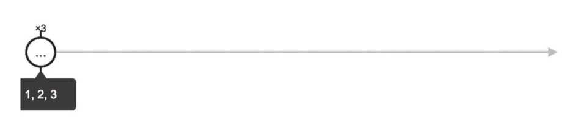
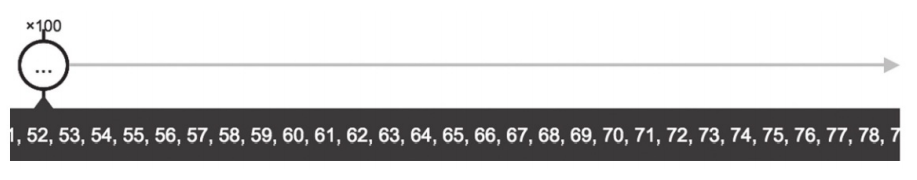
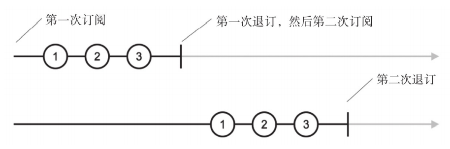
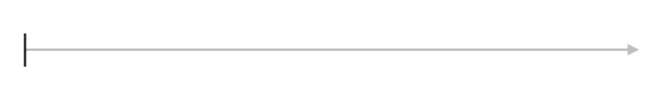
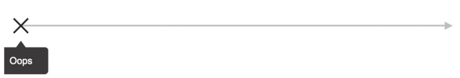
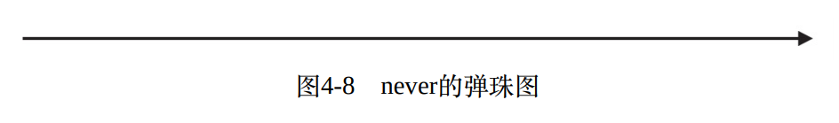

# 创建数据流

除了上帝,一切皆有起源.
作为数据流的源头, 也就是能够创建Observable的操作符.
这一类操作符大多都是静态方法(并不全是).

创建类操作符一览:
|需求|对应的操作符|
|:---:|:---:|
|直接操作观察者|create|
|根据有限的数据产生同步的数据流|of|
|产生一个数值范围之内的数据|range|
|以循环的方式产生数据|generate|
|重复产生数据流中的数据|repeat 和 repeatWhen|
|产生空数据流|empty|
|产生直接出错的数据流|throw|
|产生永不完结的数据流|never|
|间隔时间产生持续数据流|interval 和 timer|
|从数组等枚举类型数据产生数据|from|
|从Promise对象产生数据流|fromPromise|
|从外部事件对象产生数据流|fromEvent 和 fromEventPattern|
|从AJAX请求结果中产生数据流|ajax|
|延迟产生数据流|defer|

## 同步的数据流
对于同步的数据流只需要关心数据是什么，以及数据的先后顺序即可。

### create
create这个操作符其实就是Observable构造函数的一个封装,没有什么特殊之处。
create操作符的实现:
```js
Observable.create = function( subscribe ){
    return new Observable(subscribe);
}

```
使用create我们可以直接控制Observable的行为；但是作为应用开发者，平时大多数时候我们都不会使用这个操作符， 因为Rxjs已经提供了大量的创建类操作符，这些操作符几乎涵盖了大部分的使用场景。所以我们没有必要再重新去造轮子。


### of 列举数据
利用of操作符，可以轻松创建一个指定数据集合的Observable。比如我们需要产生3个整数的集合，利用create操作符可能需要些很多代码，但是利用of仅需1行代码。
```js
//使用create
//使用create操作符创建3个正整数集合。
    Rx.Observable.create(observer => {
        observer.next(1);
        observer.next(2);
        observer.next(3);
        observer.complete();
    }).subscribe(
        console.log,
        null,
        ()=>{console.log('complete')}
    )
```
使用of操作符创建
```js
Rx.Observable.of(1,2,3).subscribe(console.log, null, ()=>{console.log('complete')});
```
**of产生的数据流都是同步的，也就是说产生的数据都会挤在同一时间点上**


of操作符是ColdObservable,也就是说每次订阅这个Observable时，都会从头获得数据。

### range：指定范围
如果要用of产生从1到100的数据流, 虽然是可以实现，不过这样的写法确实不可取。range可以产生一个连续数字(不一定是整数)的范围。
`range(start, count)`函数接受2个参数， start代表范围的起点值， count代表吐出的数据个数, 每当吐出一个数据之后，range便会将值递增1.
```js
//生成一个从1到100的连续的数据流。
Rx.Observable.range(1, 100).subscribe(console.log, null, ()=>console.log('complete'))
```
```js
//生一个从10.5到15.5的连续的数据流。
Rx.Observable.range(10.5, 5).subscribe(console.log, null, ()=>console.log('complete'))
```
和of操作符一样， range操作符产生的数据也是会堆积在同一时刻。
  

### generate：Rxjs中的for循环
generate操作符类似一个for循环： 产生一个初始值，每次递增这个初始值，直到满足某个条件时才会停止循环。
```js
//产生10以内为偶数的平方。
Rx.Observable.generate(
    0, //初始值
    value => value <= 10,  //如果条件满足 值 <= 10那么继续执行。
    value => value + 2,   //每次执行之后值递增2
    value => value * value // 输出结果： 偶数的平方
).subscribe(console.log)
```
`generate`函数一共有4个参数， 第一个参数是初始值， 第二个参数是条件判断， 第三个是值的递增， 第四个参数是产生的结果。
```js
//利用generate实现range的功能
const range = (start ,count) => {
    const max = start + count;
    return Rx.Observable.generate(
        start,
        v => v < max,
        v => v + 1,
        v => v
    )
}
```

### repeat：重复某个Observable的数据流
上面接触的操作符都是静态操作符。而repeat操作符为实例操作符，你可以使用打补丁的方式引入， 或者使用支持lettable的方式引入。
打补丁方式引入
```js
import 'rxjs/add/operaotr/repeat'
```
lettable支持的方式引入
```js
import { repeat } from 'rxjs/operators/repeat'
```
repeat的功能就是重复上游的Observable若干次。
若需要一个 1，2，3的序列10次。
```js
//重复1，2，3 序列10次
Rx.Observable.of(1,2,3).repeat(10).subscribe(console.log);
```
关于repeat的实现： repeat会重复订阅并退订上游的Observable 10次。
```js
//每隔1秒生成一个数字， 直到第4秒上游Observable完结。
Rx.Observable.create(observer=>{
    console.log('Observable 被 observer subscribe了！')
    setTimeout(() => observer.next(1), 1000)
    setTimeout(() => observer.next(2), 2000)
    setTimeout(() => observer.next(3), 3000)
    setTimeout(() => observer.complete(), 4000);
    return {
        unsubscribe : ()=>{ console.log('退订了Observable') }
    }
}).repeat(2).subscribe(console.log, null , ()=> console.log('repeat complete'));
```
输出结果：
> Observable 被 observer subscribe了！
> 1
> 2
> 3
> 退订了Observable
> Observable 被 observer subscribe了！
> 1
> 2
> 3
> repeat complete
> 退订了Observable

repeat会在上游的Observable完结之后(因为需要确定上游的Observable不会吐出更多数据)，取消订阅(unSubscribe)，然后立刻重新订阅(subscribe).重复的次数取决于传入repat的参数值。

  


repeat是十分依赖上游Observable的完结的。如果上游Observable始终不会完结，那么repeat也不会执行重复订阅的操作。
```js
//如果上游的Observable不及时完结。
Rx.Observable.create( observer => {
    console.log('Observable 被 observer subscribe了！')
    setTimeout(() => observer.next(1), 1000)
    setTimeout(() => observer.next(2), 2000)
    setTimeout(() => observer.next(3), 3000) 
    return {
        unsubscribe : ()=>{ console.log('退订了Observable') }
    }
}).repeat(2).subscribe(console.log, null , ()=> console.log('repeat complete'));
```
输出结果：
> Observable 被 observer subscribe了！
> 1
> 2
> 3

**repeat会等待上游Observable完结， 如果上游不完结，那么repeat是没有意义的**

### empty throw never 操作符
这3个操作符可以直接使用
#### empty
```js
 //empty 产生一个Observable什么都不做，然后立刻完结
Rx.Observable.empty().subscribe(
    console.log, 
    null, 
    ()=> console.log('empty complete')
)
```
输出结果：
> empty complete
  

#### throw
```js
//throw 产生一个Observable什么都不做，然后抛出一个错误
Rx.Observable.throw().subscribe(
    console.log, 
    ()=> console.log('throw error'), 
    ()=> console.log('throw complete')
)
```
输出结果：
> throw error
  

#### never
```js
//newver 产生一个Observable 什么都不做， 永远也不会完结。
Rx.Observable.never().subscribe(
    console.log, 
    ()=> console.log('never error'), 
    ()=> console.log('never complete')
)
```
输出结果:啥也没有！
  

